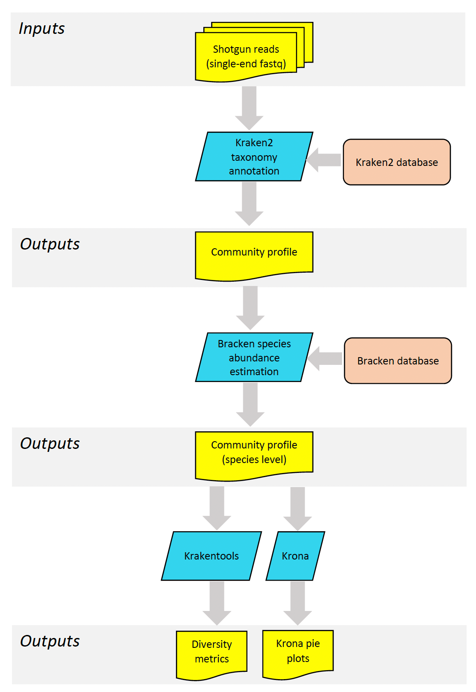
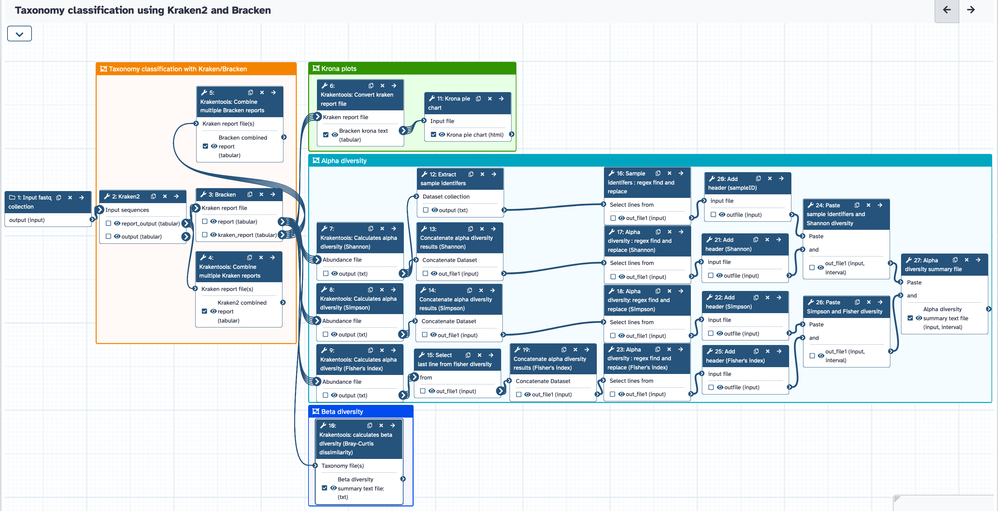
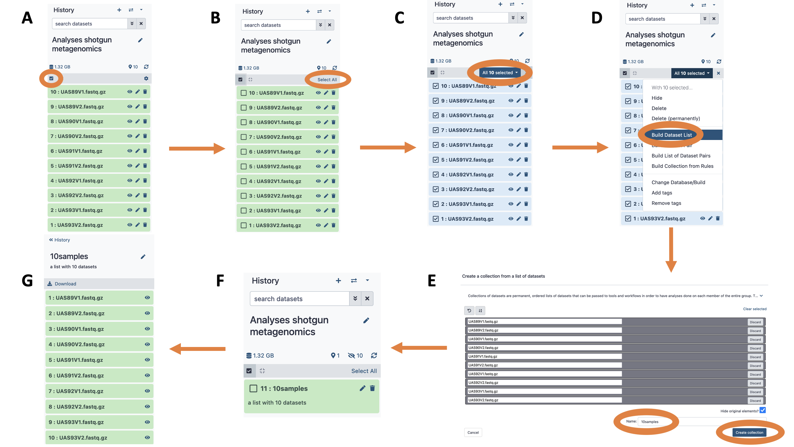
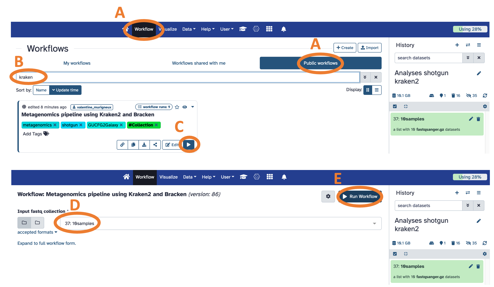
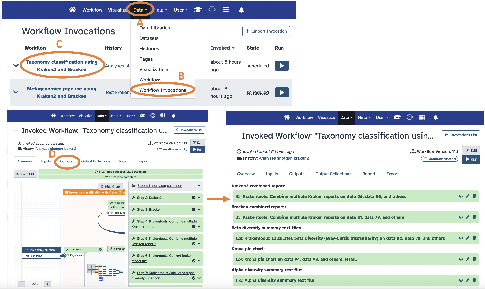

# Background and Tutorials 

This document describes how to use a shotgun metagenomics workflow on Galaxy Australia. The aim of this workflow is to handle the routine part of shotgun metagenomics data processing. The workflow is using the tools Kraken2 and Bracken for taxonomy classification and the KrakenTools to evaluate diversity metrics.  

---

# Analysis overview

The diagram below represents an overview of the shotgun metagenomics pipeline using Kraken2 and Bracken, with the tools used (blue), the databases (orange), and the input and output data (yellow).  

The different steps of the pipeline are representing in more details in the Galaxy workflow diagram below.  

## 1. Extraction of taxonomic information ([Kraken2](https://github.com/DerrickWood/kraken2) and [Bracken](https://github.com/jenniferlu717/Bracken))

* Assignation of taxonomy on the whole sequences is performed using the algorithm [Kraken2](https://github.com/DerrickWood/kraken2). Kraken2 uses a K-mer based searching algorithm to assign taxonomic labels to the sequencing reads. 

* [Bracken](https://github.com/jenniferlu717/Bracken) (Bayesian Reestimation of Abundance after Classification with Kraken) estimates the relative abundance at the species level.

* The Kraken2/Bracken database used is the PlusPF database which contains the Standard database (RefSeq archaea, bacteria, viral, plasmid, human, UniVec_Core) plus RefSeq protozoa and fungi (https://benlangmead.github.io/aws-indexes/k2)

## 2. Evaluation of diversity metrics ([KrakenTools](https://github.com/jenniferlu717/KrakenTools))

[KrakenTools](https://github.com/jenniferlu717/KrakenTools) are used to generate two types of diversity metrics from the Bracken adundance estimation file:

* **Alpha diversity** describes the diversity within a community. The Shannon's, the Simpson's and the Fisher's diversity index are calculated. 

* **Beta diversity** describes the difference in diversity between two or more communities. The Bray-Curtis dissimilarity beta diversity is calculated. 
  
# User guide
## Running a multi sample experiment

### 1. Upload the raw datasets (fastq files) in a Galaxy history

### 2. Create a dataset collection containing the fastq files 
The goal of a collection is to process all the samples at once.  

The workflow will take one fastq file per sample as input.     
* If the dataset are single-end reads, include all the files in the collection
* If the dataset are paired-end reads, only include the forward reads (R1) for each sample

Figure: Creating a collection

A. Click the checkbox icon. This will reveal checkboxes to the left of all datasets in the history.  
B. In this case we want to select all datasets, so press "Select All" button (alternatively datasets can be filtered). This will put a check mark into all checkboxes.  
C. Click "All 10 selected..." button. This will reveal a dropdown.  
D. Since this is not paired-end (or mate-pair) data we will choose to "Build Dataset List". This will open a dataset collection creator interface.  
E. Within the dataset collection creator interface, use the "Name" box to name the collection. "Hide original elements" checkbox ensures that upon creating the collection the original datasets will be hidden from the history as shown in the next figure. Click "Create collection".  
F. A collection named "10 samples" is now added to the history and original datasets are hidden, so that the history only has one item.  
G. Clicking on a collection reveals its content.

### 3. Create a samplesheet file

The samplesheet file is a text file containing two columns:
* the first column contains the name of the fastq files
* the second column contains the corresponding sample name to appear in the results tables

### 4. Run the shotgun workflow

A. Click on "Workflow" in the Galaxy horizontal menu, then click on "Public workflows"  
B. Search for the shotgun metagenomics workflow called "Taxonomy classification using Kraken2 and Bracken".  
C. Click on "Run workflow" (white arrow on the bottom right corner)  
D. Select the "input fastq collection" to be the collection you just created ("10 samples") from the currenty history  
E. Click on "Run Workflow"  
[Link to the workflow on Galaxy Australia](https://usegalaxy.org.au/u/valentine_murigneux/w/taxonomy-classification-using-kraken2-and-bracken)  

Figure: Run the workflow

### 4. Once the workflow has completed, open the report
A report will be automatically generated for each invocation of the workflow. The report is located under the menu "Data" -> "Workflow Invocations".  
A. Click on "Data" in the Galaxy horizontal menu   
B. Click on "Workflow Invocations"  
C. Scroll down and click on the name of the workflow: "Taxonomy classification using Kraken2 and Bracken".  
D. The main output files are located under the "Outputs" section.  
* Output Dataset: Kraken2 combined report
* Output Dataset: Bracken combined report (final Bracken taxonomy/species abundance)
* Output Dataset: Krona pie plot (Bracken taxonomy abundance)
* Output Dataset: Alpha diversity summary text file
* Output Dataset: Beta diversity summary text file

You can download each output dataset by clicking on the icon "Download" on the left.  
The "Output Collections" items contain the output file for each sample separately.  

Figure: Workflow Report

---

# Licenses

Usage of this workflow is dependant on the (generally permissive) licences of the underlying tools and platforms; including;

* [Kraken2](https://github.com/DerrickWood/kraken2/blob/master/LICENSE)
* [Bracken](https://github.com/jenniferlu717/Bracken/blob/master/LICENSE)
* [KrakenTools](https://github.com/jenniferlu717/KrakenTools/blob/master/LICENSE)
* [Krona](https://github.com/marbl/Krona/blob/master/KronaTools/LICENSE.txt)
* [Galaxy](https://galaxyproject.org/admin/license/)
* [Galaxy Australia terms of service](https://site.usegalaxy.org.au/about#terms-of-service)

